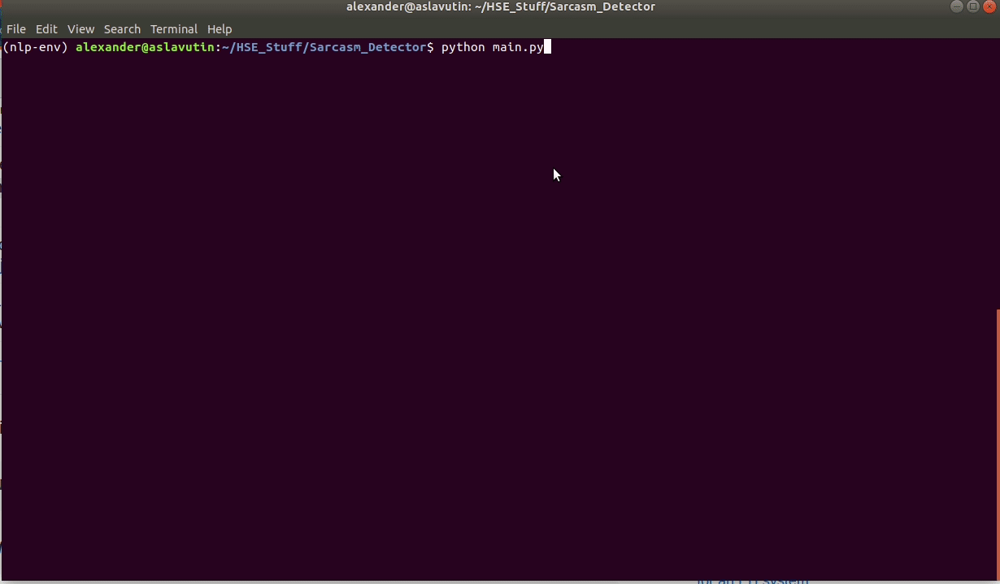
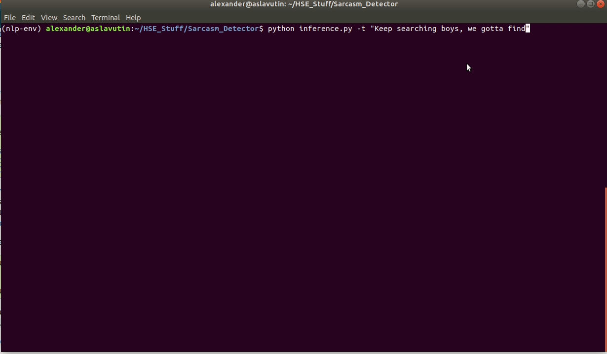
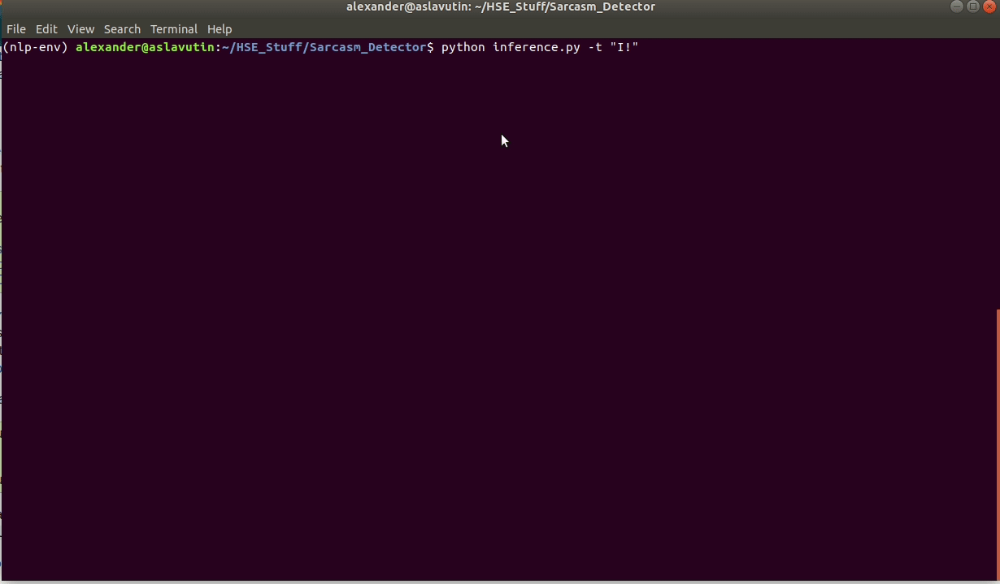

# Sarcasm_Detector

## Описание
В данной работе для выполнения поставленной задачи мы использовали претренированную сеть **Albert**. 

Соответсвенно для токенизации текста мы использовали **AlbertTokenizerFast**.

В связи с большим размером датасета, мы тренировались на его срезе (2500 примеров).

## Метрики
В результате тренировки мы добились следующих результатов:

| Epoch | Accuracy | F1   |
|-------|----------|------|
| 1     | 0.51     | 0.60 |
| 5     | 0.61     | 0.5  |
| 10    | 0.61     | 0.53 |
| 15    | 0.64     | 0.61 |

## Пример запуск тренировки 

## Пример работы на рандомном комментарии с сарказмом

## Пример работы на рандомном комментарии без сарказма

## Авторы
Работу выполнили Куклин, Кислицына, Семкин, Славутин  (17 ПМИ)
